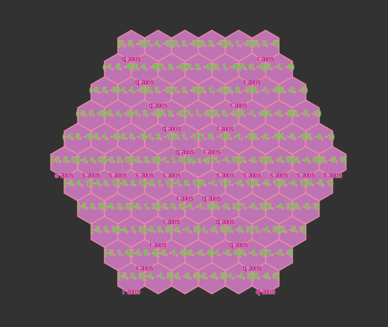
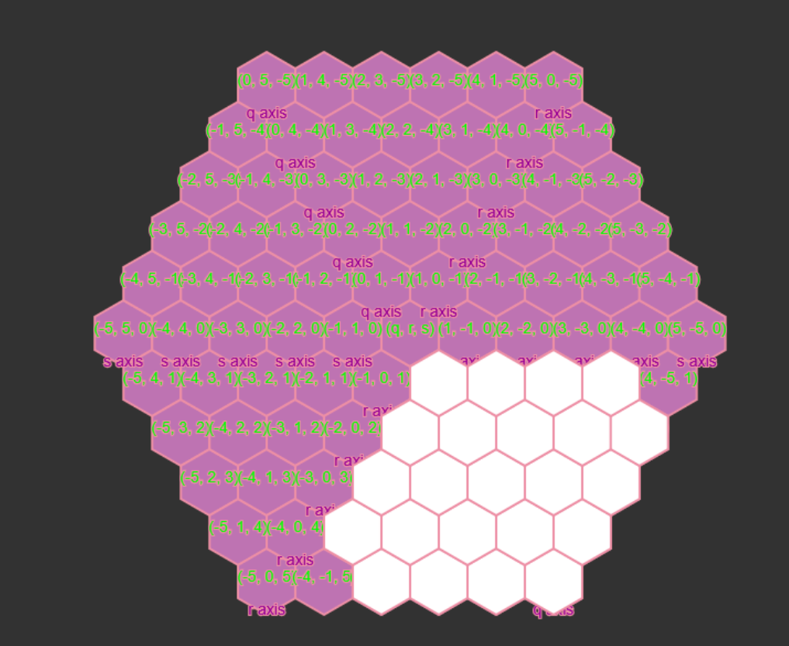
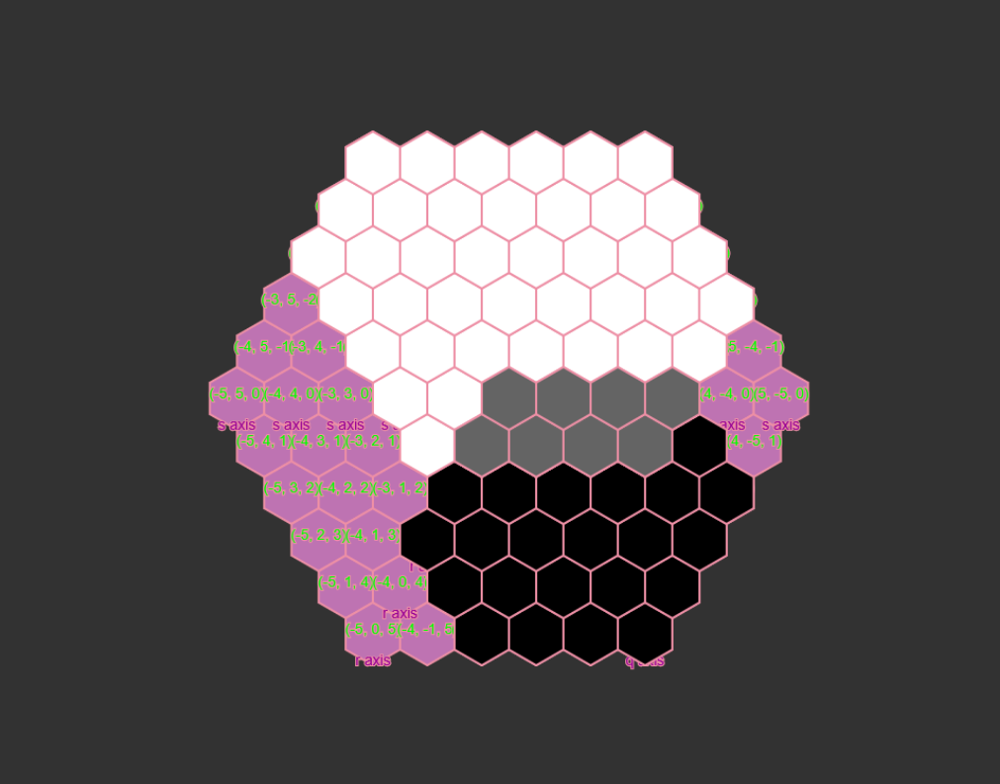

# Jan 2026 Updates

This is a passion project that I have worked on and off for the past 8ish years. Its time to complete this book. It is a whisper in my ear, a spectre that haunts me, and I must complete it to grow as a creative technologist. I need to finish what I started. 

As a recap, p5grid is currently a hexagon tiling library. It is an implementation and a rework of [redblobgames's hexagon implementation](https://www.redblobgames.com/grids/hexagons/).

There are a few arhimitic options avalible for users (addition, subtraction, multiplication) and other slice of life functions for access (area, overlap).

My main course of action is to rework my library to fit it with p5.js contributors standard. This is a relatively simple yet tedious process that the processing foundation lists [here](https://p5js.org/contribute/creating_libraries/).

I know that I dont have a lot to say -- I am old (twenty seven years) and have had mean RSI/Carpal Tunnel flareups during this frigid January, so typing is an bit of a problem.

[Trigrid Progress](/documentation/trigrid.md)